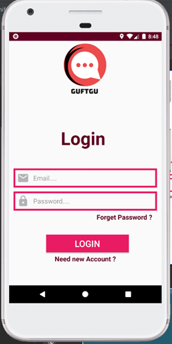
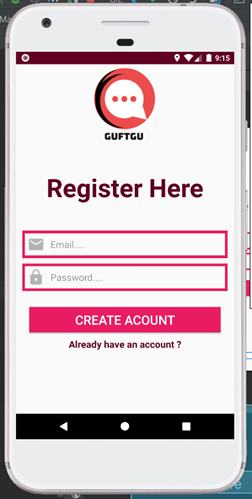
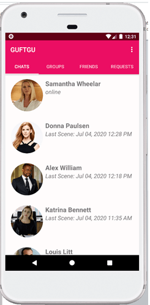
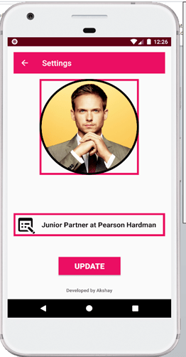
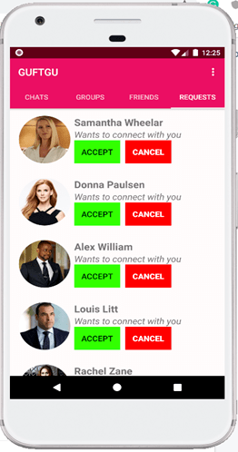

# Guftgu Chat Application

A Chat Messenger Android Application in Java.

Guftgu is free and useful messaging app. Get access to the world and connect to your friends with the brand new mesenger app.

This free app helps you to connect with your family and friends, also this app consume no data and by being low in memory it just take 2mb of your data to download

I am doing my best in order to serve you and bring awesome messaging experience by saving your time and phone memory.

<b>Login Screen: </b>

<b>Register Screen: </b>

<b>Chat Fragment: </b>

<b>Friends Fragment: </b>

<b>Settings Activity: </b>

<b> Request Fragment: </b>

